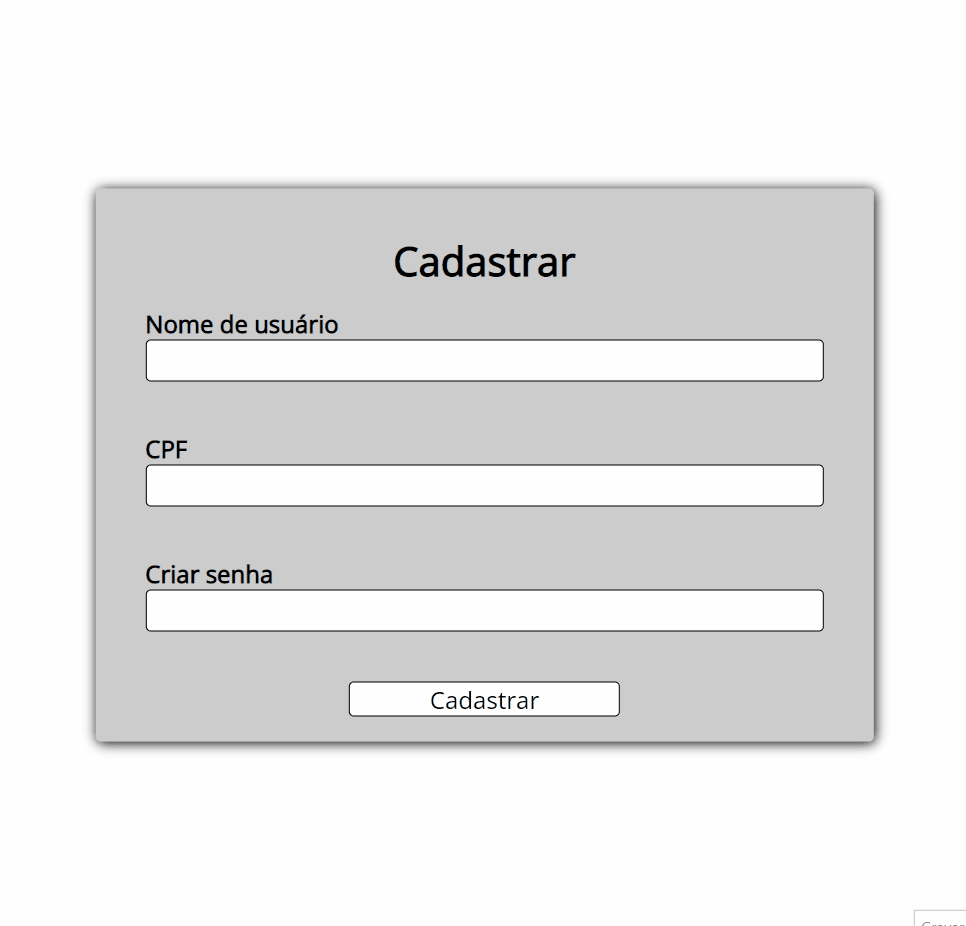
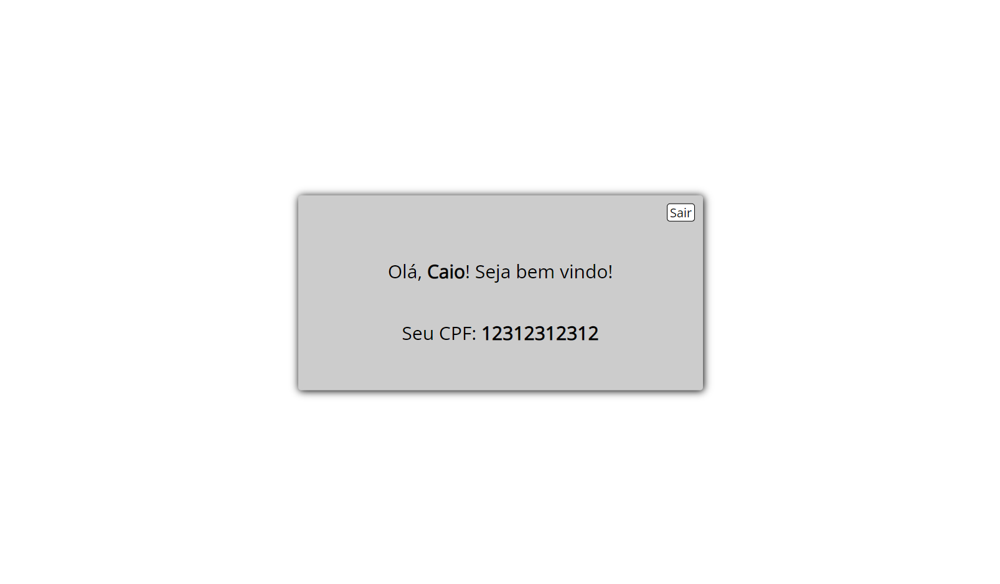
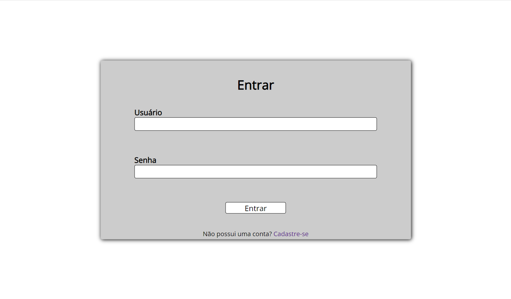
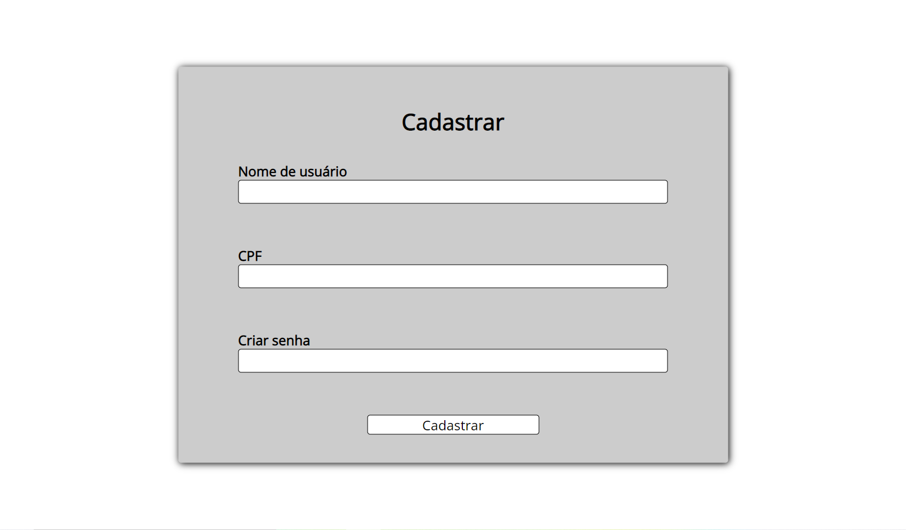

<h1 align="center">Validação de cadastro e login</h1>
<h4 align="center">Sistema que permite o usuário fazer seu cadastro e login, com validação dos dados cadastrados</h4>
<h4 align="center">Projeto feito com HTML, CSS e JavaScript</h4>

&#xa0;

**
Sumário
**

<a href="#dart-sobre">Sobre</a> &#xa0; | &#xa0;
<a href="#white_check_mark-funcionalidades">Funcionalidades</a> &#xa0; | &#xa0;
<a href="#computer-tecnologias">Tecnologias</a> &#xa0; | &#xa0;
<a href="#hammer_and_wrench-serviços">Serviços</a>

<a href="#camera-imagens">Imagens</a> &#xa0; | &#xa0;
<a href="#orange_book-como-usar">Como usar</a> &#xa0; | &#xa0;
<a href="#scroll-pré-requisitos">Pré-requisitos</a> &#xa0; | &#xa0;
<a href="#link-links">Links</a> &#xa0; | &#xa0;
<a href="#sparkles-autor">Autor</a>

## :dart: Sobre

Esse projeto foi criado com o objetivo de aprender e praticar sobre armazenar dados no localStorage, trabalhar com classes e também com programação orientada a objetos.

Consiste em validar os dados do usuário para realizar seu cadastro e ao fazer o login, verifica se o usuário está cadastrado ou não.

&#xa0;

## :white_check_mark: Funcionalidades
As principais funcionalidades do projeto são:

✔️ Permitir o cadastro de um novo usuário;

✔️ Validar se o usuário está cadastrado ou não;

✔️ Possibilitar criar várias contas e fazer o login com qualquer uma, no momento em que quiser;

✔️ Armazenar todos os dados no localStorage do navegador.

&#xa0;

## :computer: Tecnologias
* [HTML](https://developer.mozilla.org/pt-BR/docs/Web/HTML)

* [CSS](https://developer.mozilla.org/pt-BR/docs/Web/CSS)

* [JavaScript](https://www.javascript.com/)

&#xa0;

## :hammer_and_wrench: Serviços
* <a href="https://github.com/">GitHub</a>

* <a href="https://www.netlify.com/">Netlify </a>- hospedagem

&#xa0;

## :camera: Imagens
**
Exemplo de funcionamento:
**

---

**
Tela de home:
**

---
**
Tela de login:
**

---
**
Tela para cadastro de novo usuário:
**

---

&#xa0;

## :orange_book: Como usar

Caso ainda não esteja cadastrado, acesse a página de cadastro para realizar o seu cadastro.

Após a realização do cadastro, faça o login para ter acesso à página home, onde é exibido suas informações preenchidas no cadastro da conta que está logada.

Para encerrar sua seção ou entrar com outra conta, aperte o botão "Sair". Você poderá acessar sua conta novamente quando quiser.

**
⚠️ Caso você limpe os dados de navegação, os dados do localStorage do seu navegador serão apagados.
**

&#xa0;

## :scroll: Pré requisitos
Para utilizar o sistema, basta um navegador de sua preferência e conexão com internet.

&#xa0;

## :link: Links
* Repositório: https://github.com/CaioAugustoHD/Validacao-login
* Deploy: https://cadastrousuario.netlify.app/

&#xa0;

## :sparkles: Autor
<h4>Feito por Caio Augusto Pereira</h4>

&#xa0;

 

